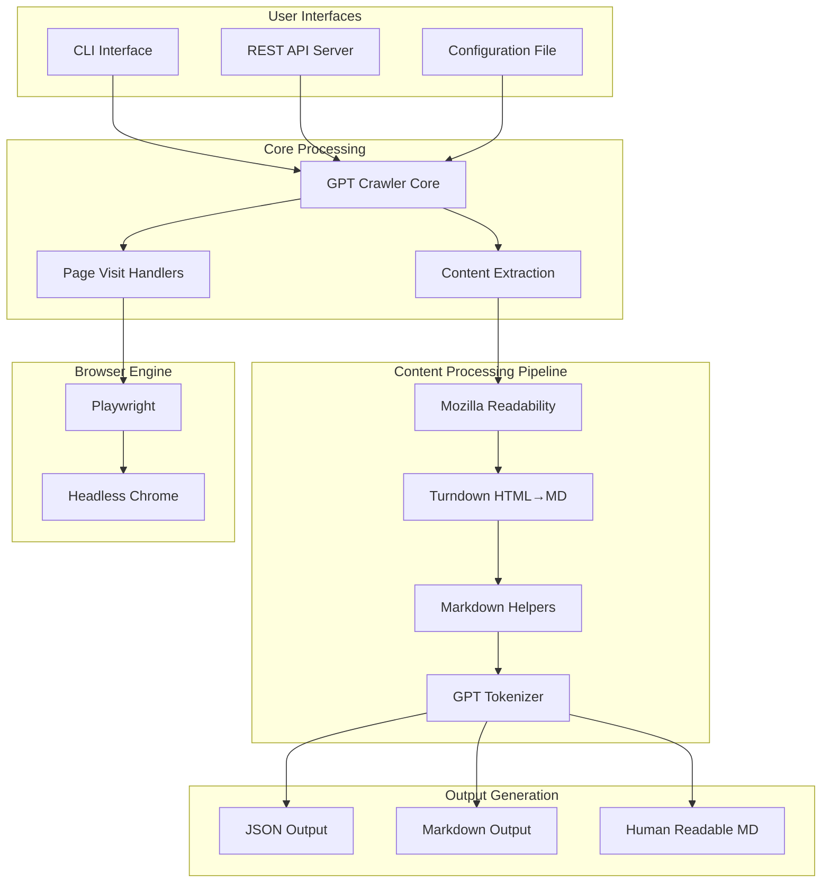
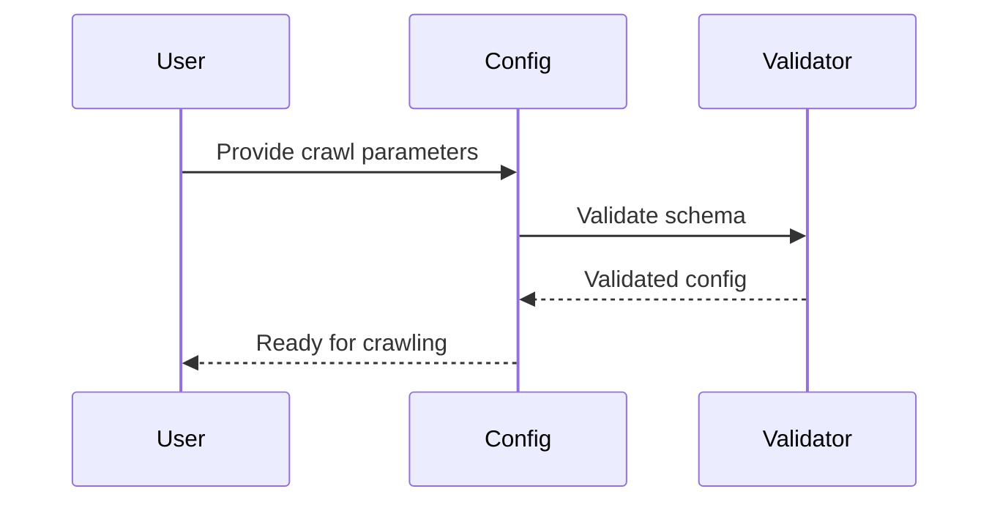
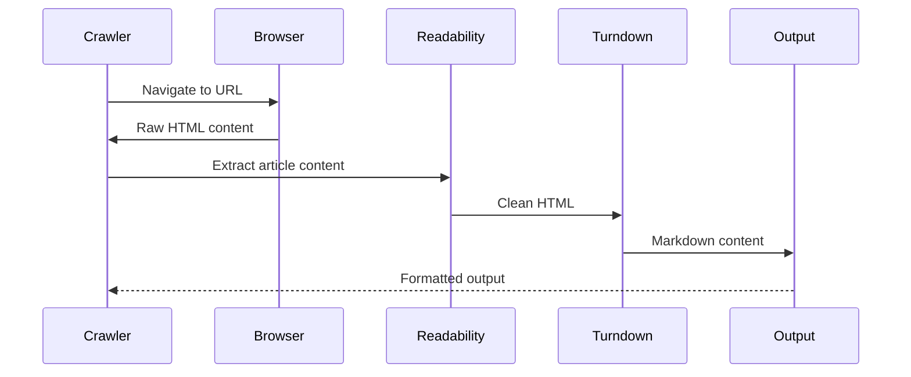

# GPT-Crawler Architecture

## Overview

GPT-Crawler is a TypeScript-based web crawling application designed to extract and convert website content into structured knowledge files for GPT model training. The system supports multiple output formats and deployment methods, providing flexible content extraction capabilities.

## System Architecture



## Core Components

### 1. Web Crawling Engine
- **Technology**: Crawlee framework with Playwright
- **Browser**: Headless Chrome via `apify/actor-node-playwright-chrome`
- **Purpose**: Automated navigation and content extraction from web pages

### 2. Content Processing Pipeline

#### Mozilla Readability (`@mozilla/readability`)
- **Purpose**: Extract main article content from web pages
- **Function**: Removes navigation, ads, and peripheral content
- **Integration**: First stage of content processing

#### Turndown (`turndown` v7.2.0)
- **Purpose**: Convert HTML content to Markdown format
- **Key Features**:
  - Configurable HTML→Markdown conversion
  - Preserves semantic structure
  - Handles code blocks, links, and formatting
- **Integration**: Processes cleaned HTML from Readability
- **Configuration**: Custom rules for specific content types

#### GPT Tokenizer (`gpt-tokenizer`)
- **Purpose**: Token counting and content optimization
- **Function**: Ensures output stays within GPT model limits
- **Integration**: Final validation stage

### 3. Configuration System

#### Configuration Schema ([`src/config.ts`](src/config.ts))
```typescript
interface Config {
  url: string;                    // Starting URL
  match: string[];               // URL patterns to crawl
  exclude?: string[];            // URLs to exclude
  maxPagesToCrawl: number;       // Crawl depth limit
  selector: string;              // CSS selector for content
  outputFileName: string;        // Output file name
  outputFileFormat: string;      // json|markdown|human_readable_markdown
  onVisitPage?: Function;        // Custom page processing
  onProcessMarkdown?: Function;  // Custom markdown processing
}
```

#### Scrape Configuration ([`scrape-config.ts`](scrape-config.ts))
- **Purpose**: Project-specific crawling rules
- **Features**:
  - URL matching patterns
  - Content selectors
  - Custom processing functions
  - Output format specification

### 4. User Interfaces

#### CLI Interface ([`src/cli.ts`](src/cli.ts))
- **Framework**: Commander.js
- **Features**: Interactive prompts via Inquirer
- **Usage**: `gpt-crawler --url <URL> --selector <CSS>`

#### REST API Server ([`src/server.ts`](src/server.ts))
- **Framework**: Express.js with CORS
- **Documentation**: Swagger UI integration
- **Endpoint**: `POST /crawl` with JSON configuration
- **Response**: Processed content in specified format

## Technology Stack

### Runtime Environment
- **Node.js**: ES2022 modules with TypeScript compilation
- **TypeScript**: Strict type checking, ES2022 target
- **Package Manager**: Yarn 1.22.22

### Key Dependencies

#### Web Crawling
| Package | Version | Purpose |
|---------|---------|---------|
| `crawlee` | ^3.0.0 | Web crawling framework |
| `playwright` | ^1.51.1 | Browser automation |

#### Content Processing
| Package | Version | Purpose |
|---------|---------|---------|
| `@mozilla/readability` | ^0.5.0 | Article content extraction |
| `turndown` | ^7.2.0 | HTML to Markdown conversion |
| `jsdom` | ^24.1.0 | DOM manipulation |
| `gpt-tokenizer` | ^2.1.2 | Token counting and optimization |

#### Server Infrastructure
| Package | Version | Purpose |
|---------|---------|---------|
| `express` | ^4.18.2 | HTTP server framework |
| `cors` | ^2.8.5 | Cross-origin resource sharing |
| `swagger-ui-express` | ^5.0.0 | API documentation |

#### Development Tools
| Package | Version | Purpose |
|---------|---------|---------|
| `typescript` | ^5.0.0 | Type checking and compilation |
| `eslint` | ^9.23.0 | Code linting with TypeScript support |
| `prettier` | ^3.1.0 | Code formatting |
| `husky` | ^8.0.0 | Git hooks for quality gates |

## Processing Flow

### 1. Configuration Loading


### 2. Content Extraction Pipeline


## Deployment Options

### 1. Docker Deployment
- **Base Image**: `apify/actor-node-playwright-chrome:18`
- **Build Strategy**: Multi-stage build for optimized production image
- **Features**:
  - Automated dependency installation
  - Playwright browser setup
  - Production-ready configuration

### 2. Local Development
- **Setup**: `npm install && npm run build`
- **CLI Usage**: `npm run start:cli`
- **Server Mode**: `npm run start:server`

### 3. Production Server
- **Environment**: Node.js with PM2 or similar process manager
- **Configuration**: Environment variables via `.env`
- **Monitoring**: Built-in logging and error handling

## File Structure

```
gpt-crawler/
├── src/                          # Source code
│   ├── config.ts                # Configuration schema and validation
│   ├── core.ts                  # Main crawling logic
│   ├── cli.ts                   # Command-line interface
│   ├── server.ts                # REST API server
│   ├── main.ts                  # Direct execution entry point
│   ├── visitPageHelpers.ts      # Page processing utilities
│   ├── markdownHelpers.ts       # Markdown processing utilities
│   └── backup-crawler-output.ts # Output backup functionality
├── scrape-config.ts             # Default crawling configuration
├── package.json                 # Dependencies and scripts
├── tsconfig.json                # TypeScript configuration
├── eslint.config.js             # Linting configuration
├── Dockerfile                   # Container build instructions
├── .env.example                 # Environment variable template
└── dist/                        # Compiled JavaScript output
```

## Configuration Management

### Environment Variables
```bash
API_PORT=5000                    # Server port
API_HOST=localhost               # Server hostname
MAX_PAGES_TO_CRAWL=45           # Default crawl limit
NODE_ENV=development             # Environment mode
```

### Scrape Configuration Options
- **URL Patterns**: Flexible matching with regex support
- **Content Selectors**: CSS selectors for precise content targeting
- **Processing Hooks**: Custom functions for content transformation
- **Output Formats**: JSON, Markdown, or Human-readable Markdown

## Quality Assurance

### Code Quality
- **TypeScript**: Strict type checking with ES2022 features
- **ESLint**: Type-aware linting with Prettier integration
- **Husky**: Pre-commit hooks for code quality enforcement

### Testing Strategy
- **Build Validation**: TypeScript compilation verification
- **Linting**: Automated code style and error checking
- **Format Checking**: Prettier consistency validation

## Extension Points

### Custom Processing Functions
```typescript
// Page visit customization
const customVisitPage = (page: Page) => {
  // Custom DOM manipulation
  return page.evaluate(() => {
    // Remove unwanted elements
    document.querySelectorAll('.ads').forEach(el => el.remove());
  });
};

// Markdown post-processing
const customMarkdownProcessor = (markdown: string) => {
  // Custom markdown transformations
  return markdown.replace(/pattern/g, 'replacement');
};
```

### Output Format Extensions
The system supports custom output formats through the configuration interface, allowing for specialized content formatting based on target use cases.

## Performance Considerations

### Optimization Strategies
- **Docker Multi-stage Build**: Reduced production image size
- **Dependency Management**: Separate dev/production dependencies
- **Browser Resource Management**: Efficient Playwright usage
- **Content Processing**: Streaming where possible for large documents

### Scalability Features
- **Configurable Concurrency**: Adjustable crawling parallelism
- **Memory Management**: Efficient content processing pipeline
- **Error Recovery**: Robust error handling and retry mechanisms

## Security Considerations

### Input Validation
- **Configuration Schema**: Zod-based runtime validation
- **URL Sanitization**: Safe URL handling and validation
- **Content Filtering**: Configurable content exclusion rules

### Deployment Security
- **Container Isolation**: Docker-based deployment
- **Environment Variables**: Secure configuration management
- **CORS Configuration**: Controlled cross-origin access